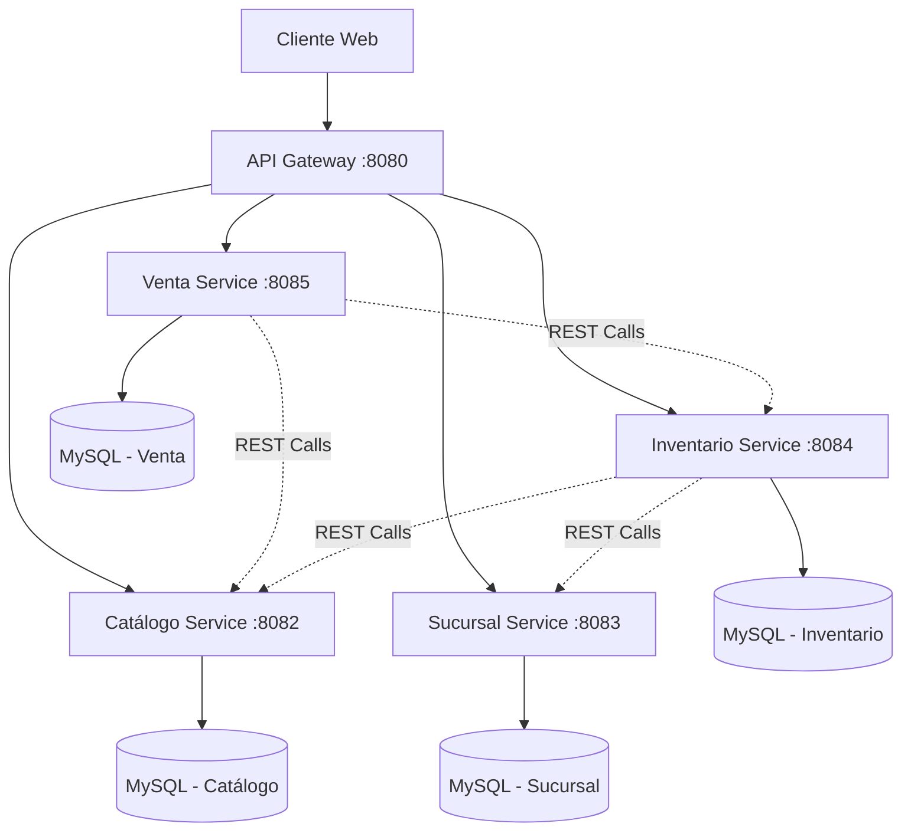

# 🚴‍♂️ MasterBikes HATEOAS - Sistema de Gestión de Bicicletas

<div align="center">


**Sistema distribuido de microservicios para la gestión integral de una tienda de bicicletas**  
*Implementando principios REST nivel 3 con HATEOAS*

</div>

---

## 📋 Tabla de Contenidos

- [🎯 Descripción del Proyecto](#-descripción-del-proyecto)
- [🏗️ Arquitectura del Sistema](#️-arquitectura-del-sistema)
- [🔧 Microservicios](#-microservicios)
- [📚 Implementación HATEOAS](#-implementación-hateoas)
- [🚀 Tecnologías Utilizadas](#-tecnologías-utilizadas)
- [📁 Estructura del Proyecto](#-estructura-del-proyecto)
- [⚙️ Instalación y Configuración](#️-instalación-y-configuración)
- [🔗 API Endpoints](#-api-endpoints)
- [🖥️ Frontend](#️-frontend)
- [📊 Base de Datos](#-base-de-datos)
- [🧪 Testing](#-testing)
- [📈 Características Principales](#-características-principales)
- [🤝 Contribución](#-contribución)
- [📝 Documentación Adicional](#-documentación-adicional)

---

## 🎯 Descripción del Proyecto

**MasterBikes HATEOAS** es un sistema distribuido de microservicios desarrollado para la gestión integral de una tienda de bicicletas. El proyecto implementa una arquitectura de microservicios utilizando **Spring Boot**, **Spring Cloud Gateway** y principios **REST nivel 3** con **HATEOAS** (Hypermedia as the Engine of Application State).

### 🎯 Objetivos Académicos

- Implementar una arquitectura de microservicios escalable y mantenible
- Aplicar patrones de diseño de software en un entorno distribuido
- Demostrar el uso de HATEOAS para crear APIs REST verdaderamente hipermedia
- Integrar múltiples tecnologías del ecosistema Spring
- Desarrollar una aplicación completa con frontend y backend

### 🏢 Dominio de Negocio

El sistema gestiona:
- **Catálogo de productos**: Bicicletas, componentes y accesorios
- **Inventario**: Control de stock por sucursal
- **Sucursales y empleados**: Gestión de ubicaciones y personal
- **Ventas y facturación**: Proceso completo de venta
- **Personalización**: Configuración custom de bicicletas

---

## 🏗️ Arquitectura del Sistema

### Patrón de Arquitectura: Microservicios

El sistema implementa una arquitectura de microservicios distribuida siguiendo los principios de:

- **Single Responsibility**: Cada servicio tiene una responsabilidad específica
- **Autonomía**: Los servicios son independientes y autónomos
- **Descentralización**: Base de datos por servicio
- **Tolerancia a fallos**: Diseño resiliente
- **Escalabilidad horizontal**: Cada servicio puede escalarse independientemente



### Comunicación Entre Servicios

- **Sincrónica**: REST API calls usando `RestTemplate`
- **Gateway Pattern**: API Gateway como punto de entrada único
- **Service Discovery**: Configuración estática por puerto
- **Load Balancing**: A través del API Gateway

---

## 🔧 Microservicios

### 1. 🛠️ API Gateway (Puerto 8080)
**Punto de entrada único al sistema**

- **Tecnología**: Spring Cloud Gateway
- **Función**: Enrutamiento, balanceo de carga, CORS
- **Configuración**: application.properties con rutas definidas

```properties
spring.cloud.gateway.server.webflux.routes[0].id=catalogo-service
spring.cloud.gateway.server.webflux.routes[0].uri=http://localhost:8082
spring.cloud.gateway.server.webflux.routes[0].predicates[0]=Path=/api/catalogo/**
```

### 2. 📚 Catálogo Service (Puerto 8082)
**Gestión del catálogo de productos**

- **Entidades**: `Bicicleta`, `Componente`, `Accesorio`
- **HATEOAS**: Implementación completa con RepresentationModel
- **Funcionalidades**:
  - CRUD de productos
  - Validación de compatibilidad entre componentes
  - Configuración de bicicletas personalizadas
  - API REST con hipervínculos

**Modelo HATEOAS Ejemplo**:
```java
@Data
public class AccesorioModel extends RepresentationModel<AccesorioModel> {
    private Long id;
    private String modelo;
    private String categoria;
    // ...enlaces automáticos self, collection
}
```

### 3. 📦 Inventario Service (Puerto 8084)
**Control de stock y movimientos**

- **Entidades**: `Inventario`, `MovimientoInventario`
- **Funcionalidades**:
  - Control de stock por sucursal
  - Registro de movimientos (ENTRADA, SALIDA, AJUSTE)
  - Reportes de inventario
  - Integración con otros servicios

### 4. 🏢 Sucursal Service (Puerto 8083)
**Gestión de sucursales y empleados**

- **Entidades**: `Sucursal`, `Empleado`
- **Funcionalidades**:
  - CRUD de sucursales
  - Gestión de empleados
  - Información de ubicaciones
  - Horarios de atención

### 5. 💰 Venta Service (Puerto 8085)
**Procesamiento de ventas y facturación**

- **Entidades**: `Venta`, `DetalleVenta`, `Factura`
- **Funcionalidades**:
  - Procesamiento de ventas
  - Generación de facturas
  - Actualización automática de inventario
  - Historial de transacciones

---

## 📚 Implementación HATEOAS

### Nivel de Madurez REST: Nivel 3

El sistema implementa el **Modelo de Madurez Richardson** en su nivel más alto:

- **Nivel 0**: HTTP como protocolo de transporte ✅
- **Nivel 1**: Recursos individuales ✅
- **Nivel 2**: Verbos HTTP y códigos de estado ✅
- **Nivel 3**: Controles hipermedia (HATEOAS) ✅

### Componentes HATEOAS

#### 1. Representation Models
```java
@Data
public class AccesorioModel extends RepresentationModel<AccesorioModel> {
    // Propiedades del recurso
    // Enlaces se añaden automáticamente
}
```

#### 2. Assemblers
```java
@Component
public class AccesorioAssembler implements RepresentationModelAssembler<Accesorio, AccesorioModel> {
    @Override
    public AccesorioModel toModel(Accesorio entity) {
        AccesorioModel model = new AccesorioModel();
        // Mapeo de propiedades
        model.add(linkTo(methodOn(AccesorioController.class).findById(entity.getId())).withSelfRel());
        model.add(linkTo(methodOn(AccesorioController.class).findAll()).withRel("accesorios"));
        return model;
    }
}
```

#### 3. Controladores Hipermedia
```java
@RestController
public class AccesorioController {
    @GetMapping
    public CollectionModel<AccesorioModel> findAll() {
        List<AccesorioModel> accesorios = accesorioService.findAll().stream()
                .map(accesorioAssembler::toModel)
                .collect(Collectors.toList());
        return CollectionModel.of(accesorios);
    }
}
```

### Ejemplo de Respuesta HATEOAS

```json
{
  "id": 1,
  "modelo": "Casco MTB Pro",
  "categoria": "Seguridad",
  "marca": "SafeBike",
  "precioUnitario": 45000,
  "_links": {
    "self": {
      "href": "http://localhost:8080/api/catalogo/accesorios/1"
    },
    "accesorios": {
      "href": "http://localhost:8080/api/catalogo/accesorios"
    }
  }
}
```

---

## 🚀 Tecnologías Utilizadas

### Backend
- **Java 17**: Lenguaje de programación principal
- **Spring Boot 3.5.0+**: Framework de aplicación
- **Spring Cloud Gateway 2025.0.0**: API Gateway
- **Spring Data JPA**: Persistencia de datos
- **Spring HATEOAS**: Implementación de hipermedia
- **MySQL 8.0+**: Base de datos relacional
- **Maven**: Gestión de dependencias
- **Lombok**: Reducción de código boilerplate

### Frontend
- **HTML5/CSS3**: Estructura y estilos
- **JavaScript ES6+**: Lógica del cliente
- **Bootstrap 5.3**: Framework CSS
- **Swiper.js**: Carruseles interactivos
- **Font Awesome**: Iconografía

### Herramientas de Desarrollo
- **Maven Wrapper**: Gestión de versiones de Maven
- **Spring DevTools**: Desarrollo ágil
- **SpringDoc OpenAPI**: Documentación automática de APIs

---

## 📁 Estructura del Proyecto

```
masterbikes-hateoas/
├── 📁 api-gateway/                 # Gateway de microservicios
│   ├── src/main/
│   │   ├── java/masterbikes/api_gateway/
│   │   │   ├── ApiGatewayApplication.java
│   │   │   └── config/CorsConfig.java
│   │   └── resources/application.properties
│   └── pom.xml
├── 📁 catalogo-service/           # Microservicio de catálogo
│   ├── src/main/java/masterbikes/catalogo_service/
│   │   ├── controller/            # Controladores REST
│   │   ├── hateoas/              # Modelos y Assemblers HATEOAS
│   │   ├── model/                # Entidades JPA
│   │   ├── repository/           # Repositorios de datos
│   │   ├── service/              # Lógica de negocio
│   │   └── dto/                  # Data Transfer Objects
│   └── pom.xml
├── 📁 inventario-service/         # Microservicio de inventario
├── 📁 sucursal-service/          # Microservicio de sucursales
├── 📁 venta-service/             # Microservicio de ventas
├── 📁 frontend/                   # Aplicación web cliente
│   ├── index.html                # Página principal
│   ├── css/                      # Hojas de estilo
│   ├── js/                       # Scripts del cliente
│   ├── images/                   # Recursos gráficos
│   └── pages/                    # Páginas adicionales
└── README.md                     # Documentación principal
```

---

## ⚙️ Instalación y Configuración

### Prerrequisitos

- **Java Development Kit (JDK) 17** o superior
- **MySQL 8.0+** instalado y configurado
- **Git** para clonar el repositorio
- **Maven 3.6+** (opcional, se usa Maven Wrapper)

### 1. Clonar el Repositorio

```bash
git clone <repository-url>
cd masterbikes-hateoas
```

### 2. Configuración de Base de Datos

Crear las bases de datos necesarias en MySQL:

```sql
CREATE DATABASE masterbikes_catalogo_01v;
CREATE DATABASE masterbikes_inventario_01v;
CREATE DATABASE masterbikes_sucursal_01v;
CREATE DATABASE masterbikes_venta_01v;
```

### 3. Configuración de Servicios

Cada microservicio tiene su archivo `application.properties` configurado para:
- Puerto específico
- Conexión a base de datos MySQL
- Configuración JPA/Hibernate

### 4. Ejecución de Servicios

**Orden recomendado de inicio:**

1. **Bases de datos MySQL** (deben estar ejecutándose)

2. **Microservicios** (en paralelo):
```bash
# Terminal 1 - Catálogo Service
cd catalogo-service
./mvnw spring-boot:run

# Terminal 2 - Inventario Service  
cd inventario-service
./mvnw spring-boot:run

# Terminal 3 - Sucursal Service
cd sucursal-service
./mvnw spring-boot:run

# Terminal 4 - Venta Service
cd venta-service
./mvnw spring-boot:run
```

3. **API Gateway** (último):
```bash
# Terminal 5 - API Gateway
cd api-gateway
./mvnw spring-boot:run
```

4. **Frontend**:
```bash
# Servir con servidor web local
cd frontend
python -m http.server 3000
# o usar Live Server en VS Code
```

### 5. Verificación de Servicios

- **API Gateway**: http://localhost:8080
- **Catálogo Service**: http://localhost:8082
- **Sucursal Service**: http://localhost:8083  
- **Inventario Service**: http://localhost:8084
- **Venta Service**: http://localhost:8085
- **Frontend**: http://localhost:3000

---

## 🔗 API Endpoints

### API Gateway Routes (Puerto 8080)

| Servicio | Ruta Gateway | Servicio Destino |
|----------|--------------|------------------|
| Catálogo | `/api/catalogo/**` | localhost:8082 |
| Sucursal | `/api/sucursal/**` | localhost:8083 |
| Inventario | `/api/inventario/**` | localhost:8084 |
| Venta | `/api/venta/**` | localhost:8085 |

### Catálogo Service - Endpoints HATEOAS

#### Accesorios
- `GET /api/v1/catalogo/accesorios` - Lista todos los accesorios con enlaces
- `POST /api/v1/catalogo/accesorios` - Crear nuevo accesorio
- `GET /api/v1/catalogo/accesorios/{id}` - Obtener accesorio específico con enlaces
- `DELETE /api/v1/catalogo/accesorios/{id}` - Eliminar accesorio

#### Bicicletas
- `GET /api/v1/catalogo/bicicletas` - Lista todas las bicicletas
- `POST /api/v1/catalogo/bicicletas` - Crear nueva bicicleta
- `GET /api/v1/catalogo/bicicletas/{id}` - Obtener bicicleta específica
- `DELETE /api/v1/catalogo/bicicletas/{id}` - Eliminar bicicleta

#### Componentes
- `GET /api/v1/catalogo/componentes` - Lista todos los componentes
- `POST /api/v1/catalogo/componentes` - Crear nuevo componente
- `GET /api/v1/catalogo/componentes/{id}` - Obtener componente específico
- `DELETE /api/v1/catalogo/componentes/{id}` - Eliminar componente

### Otros Servicios

**Inventario Service:**
- `GET /api/v1/inventarios` - Gestión de inventario
- `POST /api/v1/movimientosinventario` - Registro de movimientos
- `GET /api/v1/reportesucursal` - Reportes por sucursal

**Sucursal Service:**
- `GET /api/v1/sucursales` - CRUD de sucursales
- `GET /api/v1/empleados` - CRUD de empleados

**Venta Service:**
- `GET /api/v1/ventas` - Gestión de ventas
- `GET /api/v1/facturas` - Consulta de facturas

---

## 🖥️ Frontend

### Tecnologías Frontend

- **HTML5**: Estructura semántica
- **CSS3**: Estilos modernos con variables CSS
- **JavaScript ES6+**: Funcionalidad interactiva
- **Bootstrap 5.3**: Framework responsivo
- **Swiper.js**: Carruseles de productos

### Características de la Interfaz

- **Diseño Responsivo**: Adaptable a dispositivos móviles y desktop
- **Interfaz Moderna**: Diseño limpio y profesional
- **Carrito de Compras**: Gestión completa de productos
- **Personalización**: Configurador de bicicletas custom
- **Animaciones**: Efectos visuales suaves
- **Navegación Intuitiva**: UX optimizada

### Estructura del Frontend

```
frontend/
├── index.html                    # Página principal
├── css/
│   ├── styles.css               # Estilos globales
│   ├── navbar.css               # Estilos de navegación
│   ├── catalog-styles.css       # Estilos del catálogo
│   └── orion-futuristic.css     # Tema futurista
├── js/
│   ├── cart.js                  # Lógica del carrito
│   ├── session.js               # Gestión de sesiones
│   ├── catalogo.js              # Funcionalidad del catálogo
│   ├── personalizacion.js       # Configurador de bicicletas
│   └── pago.js                  # Proceso de pago
├── images/                      # Recursos gráficos
└── pages/                       # Páginas adicionales
```

---

## 📊 Base de Datos

### Diseño de Base de Datos por Servicio

#### Catálogo Service - `masterbikes_catalogo_01v`
```sql
-- Tabla principal de bicicletas
CREATE TABLE bicicletas (
    id BIGINT PRIMARY KEY AUTO_INCREMENT,
    modelo VARCHAR(255),
    id_cliente BIGINT,
    talla_usuario VARCHAR(50),
    precio_total DECIMAL(10,2),
    -- Referencias a componentes
    marco_id BIGINT,
    rueda_id BIGINT,
    freno_id BIGINT,
    manubrio_id BIGINT,
    sillin_id BIGINT
);

-- Tabla de componentes
CREATE TABLE componentes (
    id BIGINT PRIMARY KEY AUTO_INCREMENT,
    tipo VARCHAR(100),
    marca VARCHAR(100),
    modelo VARCHAR(255),
    diametro_rueda VARCHAR(50),
    tipo_freno VARCHAR(100),
    tipo_uso VARCHAR(100),
    talla VARCHAR(50),
    precio_unitario DECIMAL(10,2)
);

-- Tabla de accesorios
CREATE TABLE accesorios (
    id BIGINT PRIMARY KEY AUTO_INCREMENT,
    modelo VARCHAR(255),
    categoria VARCHAR(100),
    marca VARCHAR(100),
    descripcion TEXT,
    talla VARCHAR(50),
    tipo_uso VARCHAR(100),
    precio_unitario DECIMAL(10,2)
);
```

#### Inventario Service - `masterbikes_inventario_01v`
```sql
-- Control de stock por sucursal
CREATE TABLE inventarios (
    id BIGINT PRIMARY KEY AUTO_INCREMENT,
    producto_id BIGINT,
    tipo_producto VARCHAR(50), -- 'BICICLETA', 'COMPONENTE', 'ACCESORIO'
    sucursal_id BIGINT,
    cantidad INT,
    fecha_actualizacion TIMESTAMP
);

-- Movimientos de inventario
CREATE TABLE movimientos_inventario (
    id BIGINT PRIMARY KEY AUTO_INCREMENT,
    inventario_id BIGINT,
    tipo_movimiento VARCHAR(50), -- 'ENTRADA', 'SALIDA', 'AJUSTE'
    cantidad INT,
    motivo VARCHAR(255),
    fecha TIMESTAMP
);
```

#### Sucursal Service - `masterbikes_sucursal_01v`
```sql
-- Sucursales
CREATE TABLE sucursales (
    id BIGINT PRIMARY KEY AUTO_INCREMENT,
    nombre VARCHAR(255),
    direccion VARCHAR(500),
    horario_apertura TIME,
    horario_cierre TIME,
    tipo_sucursal VARCHAR(100) -- 'VENTA', 'TALLER', 'MIXTA'
);

-- Empleados
CREATE TABLE empleados (
    id BIGINT PRIMARY KEY AUTO_INCREMENT,
    nombre VARCHAR(255),
    apellido VARCHAR(255),
    rol VARCHAR(100),
    sucursal_id BIGINT,
    usuario_id BIGINT,
    FOREIGN KEY (sucursal_id) REFERENCES sucursales(id)
);
```

#### Venta Service - `masterbikes_venta_01v`
```sql
-- Ventas
CREATE TABLE ventas (
    id BIGINT PRIMARY KEY AUTO_INCREMENT,
    fecha DATE,
    cliente_id BIGINT,
    sucursal_id BIGINT,
    vendedor_id BIGINT,
    total DECIMAL(10,2)
);

-- Detalle de ventas
CREATE TABLE detalles_venta (
    id BIGINT PRIMARY KEY AUTO_INCREMENT,
    venta_id BIGINT,
    producto_id BIGINT,
    tipo_producto VARCHAR(50),
    cantidad INT,
    precio_unitario DECIMAL(10,2),
    subtotal DECIMAL(10,2),
    FOREIGN KEY (venta_id) REFERENCES ventas(id)
);

-- Facturas
CREATE TABLE facturas (
    id BIGINT PRIMARY KEY AUTO_INCREMENT,
    venta_id BIGINT,
    numero_factura VARCHAR(50),
    fecha_emision TIMESTAMP,
    subtotal DECIMAL(10,2),
    iva DECIMAL(10,2),
    total DECIMAL(10,2),
    FOREIGN KEY (venta_id) REFERENCES ventas(id)
);
```

---

## 🧪 Testing

### Estrategia de Testing

Cada microservicio incluye pruebas automatizadas:

#### 1. Unit Tests
```java
@ExtendWith(SpringExtension.class)
class AccesorioServiceTest {
    @Mock
    private AccesorioRepository repository;
    
    @InjectMocks
    private AccesorioService service;
    
    @Test
    void shouldCreateAccesorio() {
        // Test logic
    }
}
```

#### 2. Integration Tests
```java
@SpringBootTest
@AutoConfigureTestDatabase
class AccesorioControllerIntegrationTest {
    @Autowired
    private TestRestTemplate restTemplate;
    
    @Test
    void shouldReturnAccesoriosWithHateoasLinks() {
        // Integration test logic
    }
}
```

#### 3. HATEOAS Tests
```java
@Test
void shouldIncludeHateoasLinks() {
    AccesorioModel model = assembler.toModel(accesorio);
    
    assertThat(model.getLinks()).hasSize(2);
    assertThat(model.getLink("self")).isPresent();
    assertThat(model.getLink("accesorios")).isPresent();
}
```

### Ejecución de Pruebas

```bash
# Ejecutar todas las pruebas de un servicio
cd catalogo-service
./mvnw test

# Ejecutar con reporte de cobertura
./mvnw test jacoco:report
```

---

## 📈 Características Principales

### 🎯 Funcionalidades de Negocio

1. **Gestión de Catálogo**
   - CRUD completo de bicicletas, componentes y accesorios
   - Validación de compatibilidad entre componentes
   - Configuración de bicicletas personalizadas
   - Precios dinámicos según configuración

2. **Control de Inventario**
   - Stock en tiempo real por sucursal
   - Registro automático de movimientos
   - Reportes de inventario detallados
   - Alertas de stock bajo

3. **Gestión de Ventas**
   - Proceso de venta completo
   - Generación automática de facturas
   - Integración con inventario
   - Historial de transacciones

4. **Administración de Sucursales**
   - Gestión de múltiples ubicaciones
   - Control de empleados por sucursal
   - Horarios y tipos de sucursal

### 🔧 Características Técnicas

1. **Arquitectura de Microservicios**
   - Servicios independientes y desplegables
   - Bases de datos por servicio
   - Comunicación vía REST API

2. **HATEOAS Nivel 3**
   - APIs autodescriptivas
   - Enlaces dinámicos en respuestas
   - Navegación por hipermedia

3. **API Gateway**
   - Punto de entrada único
   - Balanceo de carga
   - Configuración de CORS

4. **Desarrollo Moderno**
   - Java 17 con características modernas
   - Spring Boot 3.5+
   - Lombok para código limpio
   - Maven para gestión de dependencias

---

## 🤝 Contribución

### Guías de Contribución

1. **Fork** del repositorio
2. Crear **branch** para nueva funcionalidad
3. Implementar cambios siguiendo convenciones
4. Añadir **tests** correspondientes
5. Actualizar **documentación**
6. Crear **Pull Request**

### Convenciones de Código

- **Java**: Seguir convenciones de Google Java Style
- **Naming**: CamelCase para clases, camelCase para métodos
- **Commits**: Conventional Commits format
- **API**: RESTful con HATEOAS

### Estructura de Commits
```
feat(catalogo): añadir validación de compatibilidad
fix(inventario): corregir cálculo de stock
docs(readme): actualizar documentación de API
test(venta): añadir tests de integración
```

---

## 📝 Documentación Adicional

### 📚 Recursos de Aprendizaje

- [Spring Boot Documentation](https://spring.io/projects/spring-boot)
- [Spring HATEOAS Reference](https://spring.io/projects/spring-hateoas)
- [Spring Cloud Gateway](https://spring.io/projects/spring-cloud-gateway)
- [Richardson Maturity Model](https://martinfowler.com/articles/richardsonMaturityModel.html)

### 🔍 Monitoreo y Observabilidad

- **Logs**: Configuración con Logback
- **Health Checks**: Spring Boot Actuator
- **Metrics**: Micrometer integration
- **API Documentation**: SpringDoc OpenAPI

### 📋 Documentación de APIs

Acceder a la documentación Swagger de cada servicio:

- Catálogo: http://localhost:8082/swagger-ui.html
- Inventario: http://localhost:8084/swagger-ui.html  
- Sucursal: http://localhost:8083/swagger-ui.html
- Venta: http://localhost:8085/swagger-ui.html

---

<div align="center">

**🚴‍♂️ MasterBikes HATEOAS - Desarrollado con ❤️ para la educación en arquitectura de software**

*Sistema académico demostrativo de microservicios con Spring Boot y HATEOAS*

---

**📊 Estadísticas del Proyecto:**
- 5 Microservicios independientes
- 4 Bases de datos MySQL
- Implementación completa HATEOAS nivel 3
- Frontend responsive moderno
- +20 endpoints REST con hipermedia

</div>